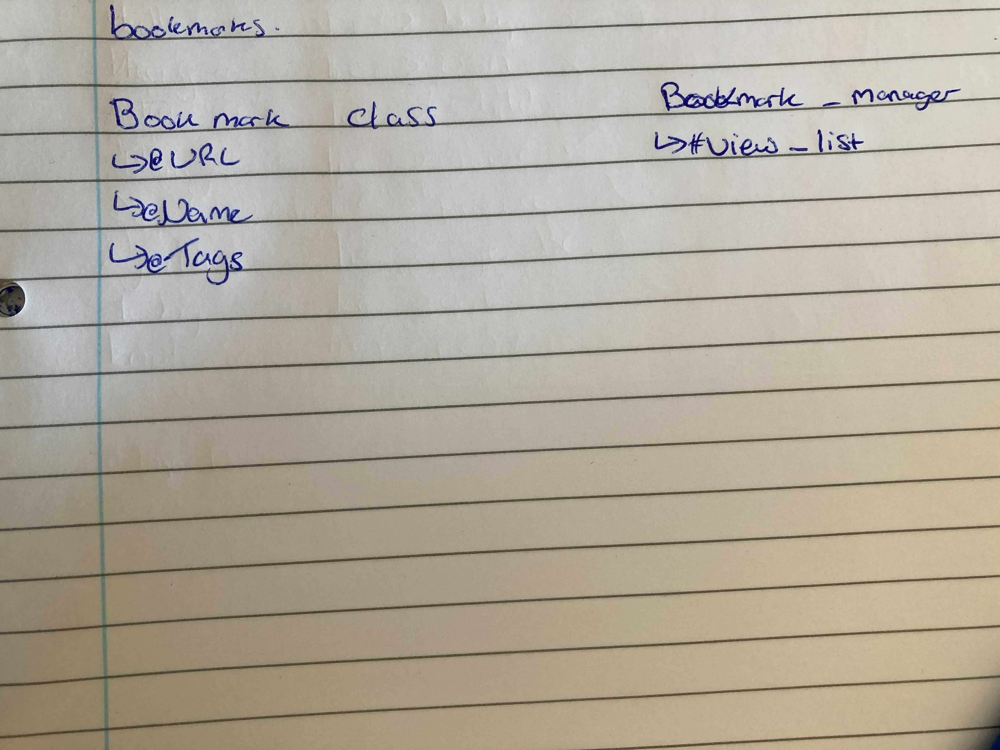

# Bookmark Manage
User stories
----------
 ```
As a User
So I can manage my bookmarks
I would like to be able to see a view of my bookmarks

As a User
So I can manage my bookmarks
I would like to be able to add a new bookmark.

As a User
So I can manage my bookmarks
I would like to be able to delete an existing bookmark.

As a User
So I can manage my bookmarks
I would like to be able to update an existing bookmark.
```
<details>
<summary>1st user story domain model</summary>
<br>

</details>
<br>

How to create/use a database for this project.

1. Connect to `psql`
2. Create the database using the `psql` command `CREATE DATABASE bookmark_manager;`
3. Create the test database using the `psql` command `CREATE DATABASE bookmark_manager_test;`
4. Connect to the database using the `pqsl` command `\c bookmark_manager;`
5. Run the query we have saved in the file `01_create_bookmarks_table.sql` for both databases.

Process
--------
* Began by creating a Home page for the Bookmaker Manager with a link to the Bookmark list page (`/bookmarks`).
* Created a Bookmark list on this page using `Bookmark.all` method which pulls all entries from the database and creates `Bookmark` objects for each one containing the title, url and id.
* Used these objects to create our bookmark list with the title acting as links to the saved url.
* On the home page added a form to add bookmarks to the manager via  `Bookmark.create`.
* On the Bookmark list page added a delete button for each bookmark via `Bookmark.delete`.
* On the Bookmark list page added an update button for each bookmark which send the user to an update page in which they can choose if they would like to update title or url or both. This page also displays the current details of the bookmark. This was done via via `Bookmark.update` and `Bookmark.find`.

Improvements
-----------
